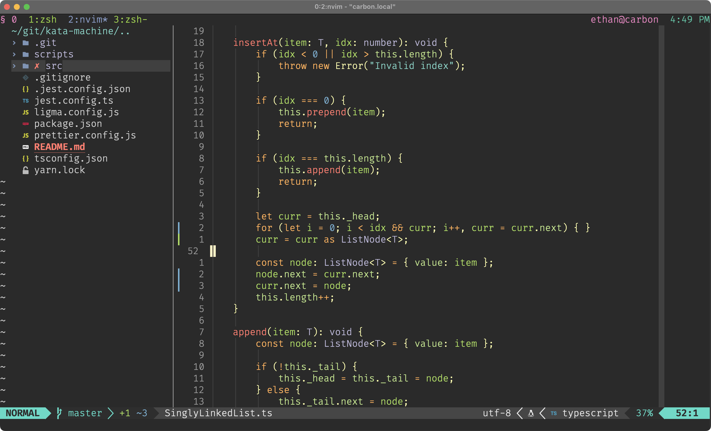

Colorscheme for neovim with support for treesitter.



# Installation

With [Packer](https://github.com/wbthomason/packer.nvim)

```lua
use { 'erietz/set3.nvim', requires = 'tjdevries/colorbuddy.nvim' }
```

# Usage

```lua
vim.cmd.colorscheme('set3')
```

or

```lua
require('colorbuddy').colorscheme('set3')
```
